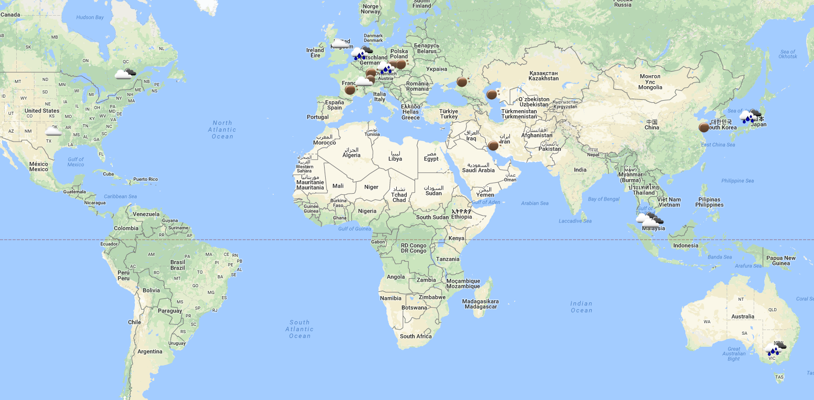
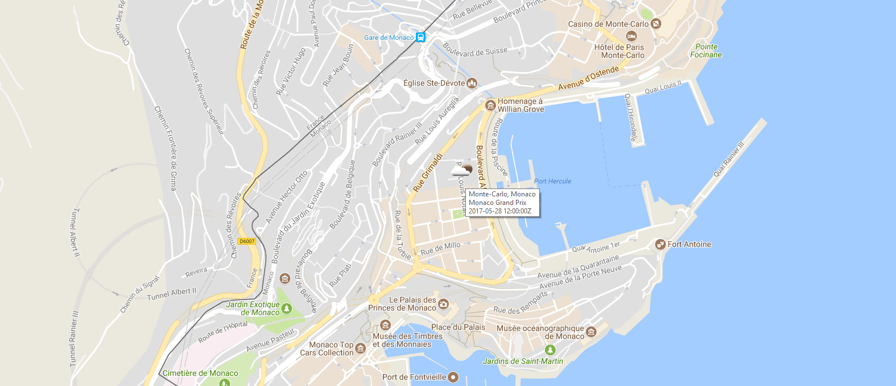
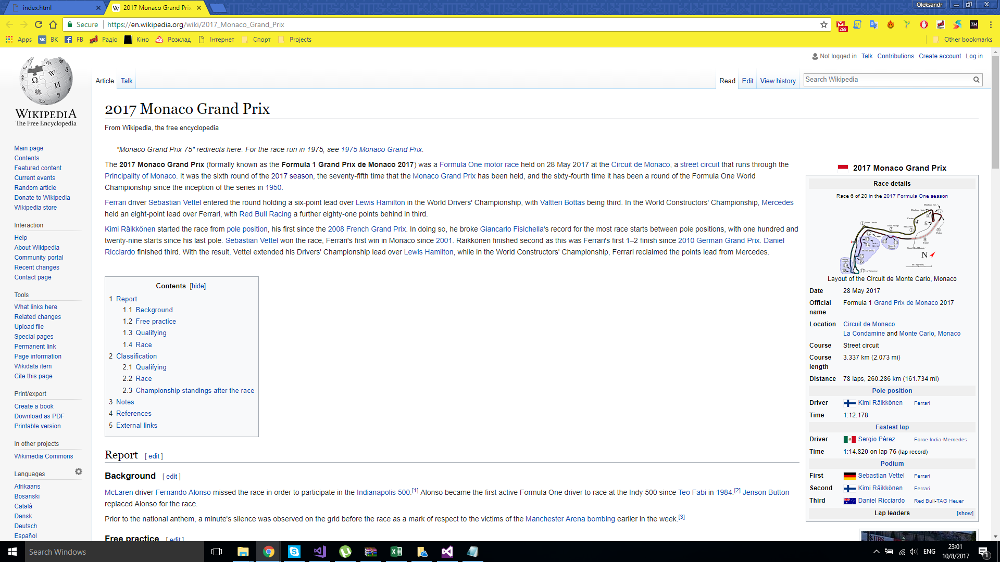

# Лабораторна робота №1. Браузерний додаток з використанням API

## Опис програми

  Даний додаток відображає [Google карту світу](https://www.google.com.ua/maps/) на якій вказані всі місця проведення гонок [Formula 1](https://www.formula1.com/) в 2017 році та [погода](https://openweathermap.org/) в тому місці на даний час.

 

  При наведенні на маркер ми побачимо короткі дані про дане місце(місто, країна, назва етапу, дата та час проведення).

 

  При натиснені на маркер на маркер відкриється вкладка браузера зі сторінкою [Wikipedia](https://www.wikipedia.org/) про даний етап гонок.

 

## Використані API
  - https://openweathermap.org/api
  - https://developers.google.com/maps/?hl=ru
  - http://ergast.com/mrd/

## Висновок

В даній роботі було набуто базових навичок роботи з API деяких сайтів та JavaScript.

